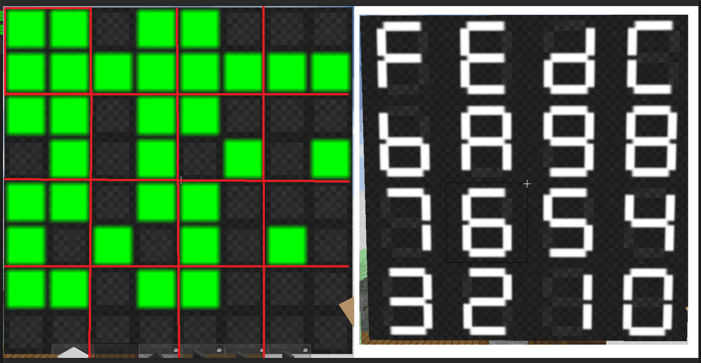

# Pixel to hex

>## Pixel to hex
* 这是一个将二位点阵图案以四个格子为单位转化为对应16进制编码的小程序
* ~~貌似是某个游戏mod里的功能,类似我的世界???反正我没玩过~~
* 转换的对应关系如图

>## Dependencies
* 项目基于VC++
* IDE: Visual Studio 2017
* 图形库: [EasyX](https://www.easyx.cn/)

